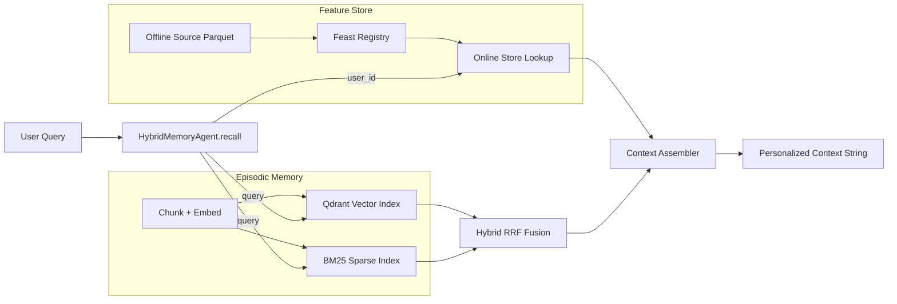

# ARCHITECTURE — Hybrid Memory Agent (Vietnamese-First)

## Contributors
- Nguyen Anh Quan

## 1) Goal and Constraints
Mục tiêu của POC là tạo một trợ lý cá nhân có khả năng “nhớ” theo hai lớp khác nhau: (1) ký ức theo sự kiện (episodic memory) để tìm lại nội dung user từng đọc hoặc từng nói; (2) hồ sơ ổn định (stable profile) để cá nhân hóa phản hồi. Hệ thống này ưu tiên chạy local, CPU-friendly, và dễ tái lập trên laptop học viên. Vì vậy, thiết kế chọn Qdrant in-memory cho vector memory, BM25 baseline cho sparse match, và Feast để mô phỏng lớp feature store online/offline.

Ràng buộc thực tế:
- Dữ liệu user Việt Nam thường code-switch vi/en, có lỗi gõ gần âm ("kubernet" thay "kubernetes").
- Truy vấn “nhắc lại tôi thích gì” cần vừa semantic retrieval vừa profile lookup.
- POC cần rõ kiến trúc và tradeoff hơn là tối ưu throughput production.

## 2) Architecture Diagram

Luồng dữ liệu:
1. `remember(text, user_id)` nhận ký ức mới, chunk theo đoạn ngắn, embed rồi upsert vào vector index, đồng thời cập nhật sparse corpus cho BM25.
2. `recall(query, user_id)` chạy semantic search + keyword search, trộn bằng RRF, lấy top-k memories của đúng user.
3. Cùng lúc, gọi Feast online để lấy profile/recent activity (`topic_affinity`, `preferred_language`, `queries_last_hour`).
4. Ghép thành context string cho lớp LLM phía sau (POC chưa gọi LLM thật).

## 3) Decision #1 — Chunking Strategy (Tradeoff Explicit)
**Chọn:** chunk theo đoạn ngắn 220 ký tự, overlap 40 ký tự (khoảng 80–120 tokens tiếng Việt tùy dấu câu).

**Phương án A (đã chọn):** fixed-size chunk + overlap.
- Ưu điểm:
  - Ổn định độ dài embedding, giảm variance chất lượng retrieval.
  - Dễ kiểm soát số chunk => predictable storage cost.
  - Phù hợp context window nhỏ khi ghép top-3/top-5 memories.
- Nhược điểm:
  - Có thể cắt ngang ý nghĩa câu nếu văn bản dài/ít dấu ngắt.

**Phương án B (không chọn):** per-conversation chunk (mỗi cuộc hội thoại một vector).
- Ưu điểm: rẻ số vector, quản trị đơn giản.
- Nhược điểm: recall kém chính xác vì chunk quá to, nhiều nhiễu; top hit khó “đúng đoạn cần trích”.

**Tradeoff kết luận:** ưu tiên retrieval quality và controllable context window hơn chi phí lưu trữ tối thiểu. Với POC cá nhân, tăng 1.5–2x số vector vẫn chấp nhận được.

## 4) Decision #2 — Feature Schema Strategy (Tradeoff Explicit)
**Chọn:** tabular features trong Feast (không dùng embedding feature view cho profile ổn định).

Schema chính:
- Entity `user_id`
- `preferred_language` (string), `topic_affinity` (string), `reading_speed_wpm` (int)
- `queries_last_hour` (int), `distinct_topics_24h` (int)

TTL đề xuất:
- `user_profile` TTL 30 ngày (slow-moving)
- `query_velocity` TTL 1 giờ (fresh signal)

**Phương án A (đã chọn):** tabular + TTL rõ ràng.
- Ưu điểm:
  - Giải thích được vì sao hệ thống cá nhân hóa theo hướng nào.
  - Rẻ compute, dễ debug drift và leakage.
  - Tương thích tốt online lookup độ trễ thấp.
- Nhược điểm:
  - Không capture sở thích ngầm đa chiều tốt như embedding profile.

**Phương án B (không chọn):** embedding features từ toàn bộ history user.
- Ưu điểm: biểu diễn latent preference giàu thông tin.
- Nhược điểm: khó giải thích, khó PIT correctness, re-index tốn kém và dễ stale.

**Tradeoff kết luận:** POC ưu tiên observability + correctness trước, nên dùng tabular schema trong Feast.

## 5) Decision #3 — Freshness Strategy (Tradeoff Explicit)
**Chọn:** freshness theo use-case thay vì một mức chung.

- Use case 1: “Recommend đọc gì tiếp” → chấp nhận 5–15 phút refresh.
  - Vì sở thích không đổi theo giây, batch ngắn giúp tiết kiệm compute.
- Use case 2: “Tôi đang quan tâm gì gần đây?” → cần gần real-time (sub-minute).
  - Dùng feature `queries_last_hour` cập nhật nhanh để bắt trend ngắn hạn.
- Use case 3: “Nhớ tài liệu vừa đọc xong” → episodic memory ưu tiên near-real-time.
  - `remember()` upsert ngay vào vector store; không chờ batch đêm.

**Phương án A (đã chọn):** mixed freshness (immediate for episodic, short-batch cho profile/recent).
- Ưu điểm: cân bằng trải nghiệm user và vận hành.
- Nhược điểm: pipeline phức tạp hơn one-shot daily batch.

**Phương án B (không chọn):** daily-only refresh cho cả memory + profile.
- Ưu điểm: cực đơn giản.
- Nhược điểm: user vừa đọc xong mà trợ lý “không nhớ” -> UX tệ.

## 6) Rejected Alternative (Explicit)
Tôi đã cân nhắc lưu toàn bộ episodic memory vào Feature Store dưới dạng embedding feature view để “một hệ thống cho tất cả”. Tôi loại phương án này vì vòng đời dữ liệu khác nhau: episodic memory cập nhật liên tục theo tương tác, còn stable profile đổi chậm. Gộp chung làm tăng chi phí re-index, khó quản trị TTL, và khó tối ưu truy vấn ANN chuyên dụng.

## 7) Vietnamese-Context Considerations
1. **Code-switch vi/en:** query có thể là “tóm tắt cloud security cho team devops”. Vì vậy hybrid search cần cả BM25 (bắt keyword kỹ thuật tiếng Anh) và vector (bắt ngữ nghĩa tiếng Việt).
2. **Phonetic typo:** user Việt hay gõ thiếu dấu hoặc gần âm (“bao mat”, “kubernet”). BM25 thuần sẽ hụt; vector giúp hồi phục một phần, nhưng cần cân nhắc tokenizer tiếng Việt tốt hơn whitespace split ở bản production.
3. **Privacy context (Decree 13 awareness):** profile features cần hạn chế PII, ưu tiên pseudonymous `user_id`, và thiết kế deletion path cho “right to erase memory”.

## 8) What This POC Does Not Handle Yet
- Chưa có mã hóa at-rest cho vector payload.
- Chưa có multi-device sync hoặc conflict resolution.
- Chưa có công cụ CRUD đầy đủ (sửa/xóa ký ức theo yêu cầu user).
- Chưa có re-ranking learned model sau RRF.

## 9) Why This Design Fits Lab 19 Concepts
- Vector + BM25 + RRF: bám sát NB2.
- Feature TTL và online lookup: bám sát NB4.
- Freshness tách lớp dữ liệu: gắn với production pattern (streaming vs batch).
- Context assembly rõ ràng để cắm LLM sau này mà không thay lõi memory.
